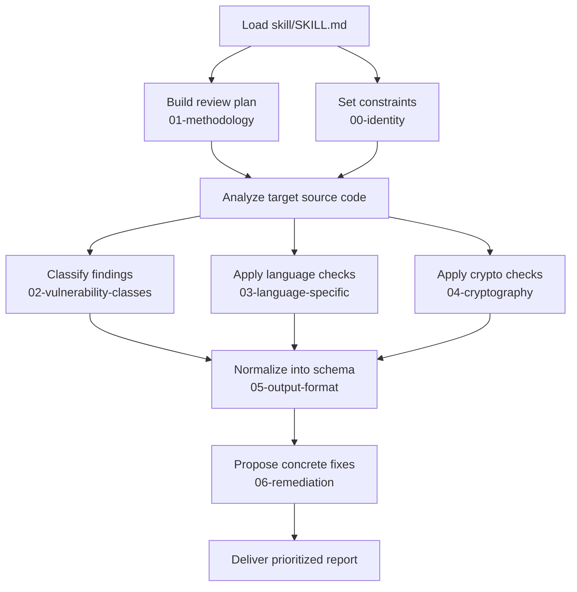

<div align="center" id="readme-top">

# AppSec Skill

**🔐 Portable secure-code review for coding agents.**

[](https://openagentskills.dev/docs/specification)
[](./LICENSE)

**[skill/](./skill/)** · **[Quick start](#quick-start)** · **[Skill layout](#agent-skills-layout)** · **[Output preview](#structured-output-preview)**

</div>

---

<details>
<summary><strong>📑 Table of contents</strong></summary>

- [🎯 Why this exists](#why-this-exists)
- [✨ Features](#features)
- [🧭 How it works](#how-it-works)
- [🚀 Quick start](#quick-start)
- [📚 Skill modules](#skill-modules)
- [👀 Structured output preview](#structured-output-preview)
- [📐 Skill layout](#agent-skills-layout)
- [🗂️ Repository layout](#repository-layout)
- [🛠️ Maintainers · evaluation harness](#maintainers-evaluation-harness)
- [🤝 Contributing](#contributing)
- [📄 License](#license)

</details>

---

<h2 id="why-this-exists">🎯 Why this exists</h2>

Most agent prompts for “check my code for security” stay one-shot and shallow. AppSec Skill encodes a **repeatable** pipeline:

| Layer | You get |
|:------|:--------|
| **Mindset & rules** | Hard constraints (cite evidence; no hallucinated line numbers). |
| **Methodology** | Multi-pass workflow so breadth and depth don’t collide. |
| **Coverage** | Vulnerability catalog + language traps + crypto checks—aligned with **OWASP** / **CWE** framing. |
| **Delivery** | One stable finding schema and remediation patterns your team can diff in Git. |

<h2 id="features">✨ Features</h2>

| Feature | Notes |
|:---:|:---|
| 📎 **Spec-shaped** | Standard **`SKILL.md`** + **`references/`** tree ([Skill layout](#agent-skills-layout)); ensure your host’s discovery paths include [`skill/`](./skill/). |
| 🧳 **Portable** | Plain Markdown skill content—no bundled runtime or API gate for **`skill/`** itself. |
| 🗺️ **Depth** | Catalog + per-language foot-guns + crypto section. |
| 📊 **Parseable output** | Shared schema in [`05-output-format.md`](./skill/references/05-output-format.md). |
| 🛠️ **Real fixes** | Language-aware remediation in [`06-remediation.md`](./skill/references/06-remediation.md). |

<h2 id="how-it-works">🧭 How it works</h2>

Your agent loads **[`skill/SKILL.md`](./skill/SKILL.md)** first, then walks the numbered chain under **`skill/references/`** **before** touching application code. Each file is a single concern—easy to extend, pin, or fork.



<h2 id="quick-start">🚀 Quick start</h2>

| Step | Action |
|:--:|--------|
| 1 | Copy [`skill/`](./skill/) (or submodule this repo). |
| 2 | Register [`skill/`](./skill/) with your host (see [Skill layout](#agent-skills-layout) for shape vs discovery). **Or:** open [`skill/SKILL.md`](./skill/SKILL.md) and read `references/` in order—no tooling required. |
| 3 | Run a prompt that matches the invocation examples below. |

**Examples**

Single file:

```text
Load the AppSec skill, then analyze path/to/file.py for security vulnerabilities.
```

Whole tree:

```text
Load the AppSec skill, then analyze all source files under path/to/project/ for security vulnerabilities.
```

<h2 id="skill-modules">📚 Skill modules</h2>

| # | Reference | Covers |
|--:|-----------|--------|
| 00 | [`00-identity.md`](./skill/references/00-identity.md) | Mindset, scope, hard rules |
| 01 | [`01-methodology.md`](./skill/references/01-methodology.md) | Three-pass review |
| 02 | [`02-vulnerability-classes.md`](./skill/references/02-vulnerability-classes.md) | Catalog + detection notes |
| 03 | [`03-language-specific.md`](./skill/references/03-language-specific.md) | Language traps |
| 04 | [`04-cryptography.md`](./skill/references/04-cryptography.md) | Crypto checks |
| 05 | [`05-output-format.md`](./skill/references/05-output-format.md) | Finding schema |
| 06 | [`06-remediation.md`](./skill/references/06-remediation.md) | Fix patterns |

<h2 id="structured-output-preview">👀 Structured output preview</h2>

Findings use the schema in [`05-output-format.md`](./skill/references/05-output-format.md). The fold-out sample is **synthetic and truncated**—real reviews must retain **every** required field.

<details>
<summary><strong>Open sample finding (illustrative)</strong></summary>

> **Illustrative only** — not from a production review.

**Finding 1: SQL Injection**

**File:** `app/db.py`  
**Lines:** 12–14  
**CWE:** CWE-89 — Improper Neutralization of Special Elements used in an SQL Command ('SQL Injection')  
**OWASP Category:** A03:2021 – Injection  
**Priority:** P1  
**Severity:** HIGH  
**Confidence:** HIGH  

#### Vulnerable Code

```python
query = f"SELECT * FROM users WHERE id = '{user_id}'"
cur.execute(query)
```

#### Description

User-controlled `user_id` is interpolated into raw SQL, allowing classic injection; an attacker can alter the query shape and exfiltrate or modify data.

#### Prioritization

Fix before release; pair with prepared statements or an ORM query API.

#### Exploitability Notes

- **Exploit Preconditions:** Attacker can influence `user_id` (form, header, API).
- **Uncertainty Boundary:** DB driver may limit some primitives; impact still high.

#### Remediation

Use parameterized queries (`cur.execute("SELECT … WHERE id = ?", (user_id,))`) or bound parameters from your stack.

#### References

- [OWASP SQL Injection](https://owasp.org/www-community/attacks/SQL_Injection)

---

```text
## Scan Summary
| Metric         | Value |
|----------------|-------|
| Files Analyzed | 1     |
| Total Findings | 1     |
| Critical       | 0     |
| High           | 1     |
```

</details>

<h2 id="agent-skills-layout">📐 Skill layout</h2>

[`skill/`](./skill/) matches **[Open Agent Skills](https://openagentskills.dev/docs/specification)**, the community **SKILL.md** convention maintained alongside **[agentskills/agentskills](https://github.com/agentskills/agentskills)**. Whether a host accepts this tree unchanged depends on **its** loader rules.

**In this repo**

| Piece | Location |
|:-----|:---------|
| Skill entrypoint | [`skill/SKILL.md`](./skill/SKILL.md) (YAML frontmatter + body; ordered `references/` list) |
| Reference modules | [`skill/references/*.md`](./skill/references/) — read in the order `SKILL.md` specifies |

**Discovery paths** vary by vendor (project `.cursor/skills`, user-level dirs, Claude Code bundles, etc.). Use the layout table above for **what’s inside** the folder; use each product’s docs for **where** it expects skills—for example Cursor’s **[Agent Skills](https://cursor.com/docs/skills)** guide. No compatibility matrix is maintained here.

*Examples only; not exhaustive or endorsed:* **Claude Code**, **Cursor**, **Kiro**, and similar hosts may ingest [`skill/`](./skill/) unchanged once discovery matches—confirm in upstream docs.

<h2 id="repository-layout">🗂️ Repository layout</h2>

| Path | Role |
|:-----|:-----|
| [`LICENSE`](./LICENSE) | MIT license for instructional materials |
| [`skill/`](./skill/) | **The product:** [`SKILL.md`](./skill/SKILL.md) + [`references/`](./skill/references/) |
| [`benchmark/`](./benchmark/) | Optional maintainer harness — [evaluation](#maintainers-evaluation-harness) |
| [`.cursor/skills/`](./.cursor/skills/) | Small Cursor stubs for that harness only |

<h2 id="maintainers-evaluation-harness">🛠️ Maintainers · evaluation harness</h2>

Optional regression for **`skill/`**: scripted **Findings → Scoring** over challenges **01–30** (**31–32** out of scope) via **Claude Code**, with spoilers stripped during staging. Protocol: [`.cursor/skills/benchmark/SKILL.md`](./.cursor/skills/benchmark/SKILL.md).

```bash
START=1 END=30 MAX_PARALLEL=30 ./benchmark/findings.sh
START=1 END=30 MAX_PARALLEL=30 ./benchmark/scoring.sh
```

<h2 id="contributing">🤝 Contributing</h2>

Improvements to skills or docs are welcome—**small, focused PRs** make it easier to review security-sensitive wording.

<h2 id="license">📄 License</h2>

This project is released under the [MIT License](https://opensource.org/licenses/MIT). See [`LICENSE`](./LICENSE).

<div align="center">

**[⬆ Back to top](#readme-top)**

</div>
