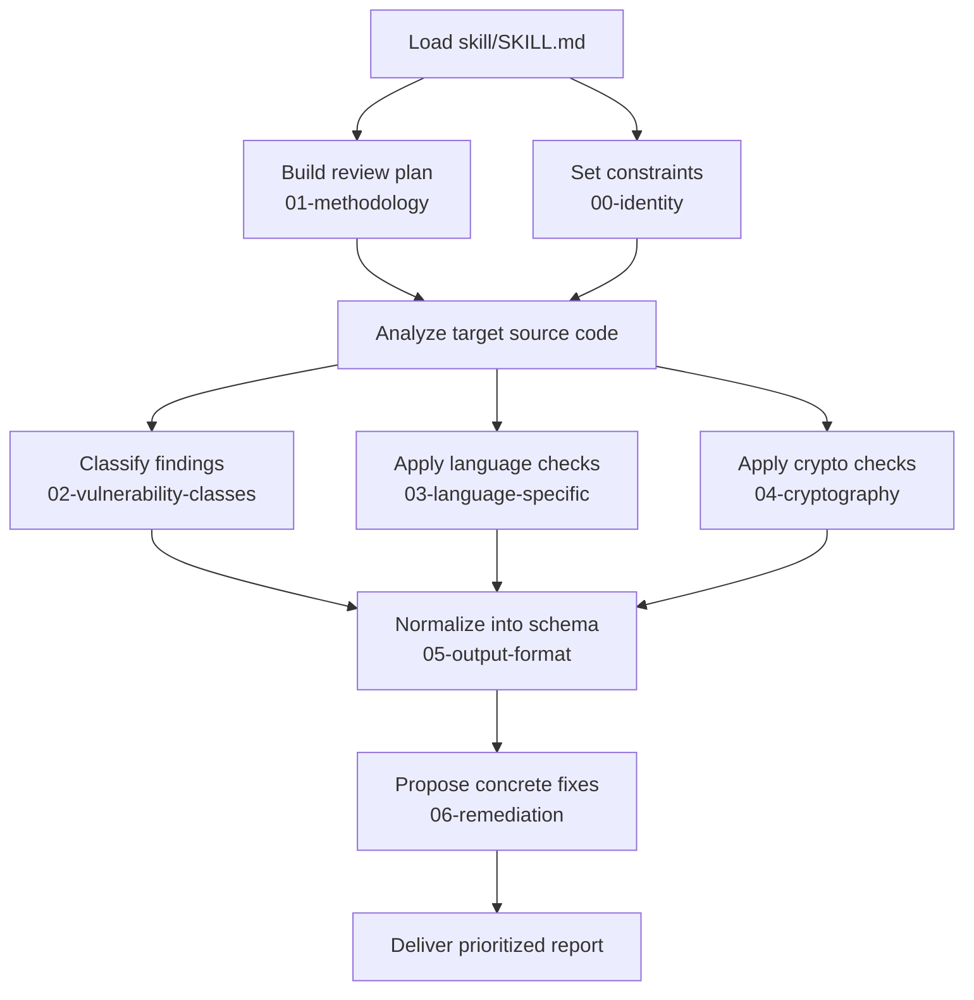

<div align="center" id="readme-top">

# AppSec Skill

**🔐 Portable secure-code review for coding agents.**

[](https://openagentskills.dev/docs/specification)
[](./LICENSE)

**[Quick start](#quick-start)** · **[Sample output](#sample-output)** · **[Skill modules](#skill-modules)** · **[Contributing](#contributing)**

</div>

---

<h2 id="quick-start">🚀 Quick start</h2>

1. Copy [`skill/`](./skill/) into your project (or clone/submodule this repo).
2. Point your agent host at [`skill/`](./skill/) — or open [`skill/SKILL.md`](./skill/SKILL.md) and read `references/` in order; no tooling required.
3. Run a review:

```text
Load the AppSec skill, then analyze path/to/file.py for security vulnerabilities.
```

For a whole tree, swap in `all source files under path/to/project/`.

<h2 id="why-appsec-skill">🎯 Why AppSec Skill</h2>

One-shot “check my code for security” prompts tend to miss classes, hallucinate line numbers, and return inconsistent reports. AppSec Skill encodes a **repeatable** review pipeline:

- **Grounded findings** — cite evidence; mark uncertainty explicitly.
- **Structured coverage** — methodology, OWASP/CWE-oriented classes, language traps, and crypto checks.
- **Actionable output** — one stable finding schema plus remediation patterns you can diff in Git.

Works with any host that loads **[Open Agent Skills](https://openagentskills.dev/docs/specification)**-shaped content ([`SKILL.md`](./skill/SKILL.md) + numbered [`references/`](./skill/references/)). Plain Markdown — no bundled runtime.

<h2 id="how-it-works">🧭 How it works</h2>

The agent loads [`skill/SKILL.md`](./skill/SKILL.md), reads the reference chain **before** application code, then delivers a prioritized report.



<h2 id="sample-output">👀 Sample output</h2>

Findings follow [`05-output-format.md`](./skill/references/05-output-format.md) — stable IDs, CWE/OWASP mapping, and SARIF-friendly fields. Real reviews must include every required field; the example below is truncated.

<details>
<summary><strong>Example finding (illustrative)</strong></summary>

**Finding 1: SQL Injection** · `APPSEC-3f1a92c4e0b1` · `app/db.py:12–14` · **HIGH** / P1 · CWE-89

```python
query = f"SELECT * FROM users WHERE id = '{user_id}'"
cur.execute(query)
```

User-controlled `user_id` is interpolated into raw SQL. Use parameterized queries or bound parameters from your stack.

</details>

<h2 id="skill-modules">📚 Skill modules</h2>

| # | Reference | Covers |
|--:|-----------|--------|
| 00 | [`00-identity.md`](./skill/references/00-identity.md) | Mindset, scope, hard rules |
| 01 | [`01-methodology.md`](./skill/references/01-methodology.md) | Three-pass review |
| 02 | [`02-vulnerability-classes.md`](./skill/references/02-vulnerability-classes.md) | Catalog + detection notes |
| 03 | [`03-language-specific.md`](./skill/references/03-language-specific.md) | Language traps |
| 04 | [`04-cryptography.md`](./skill/references/04-cryptography.md) | Crypto checks |
| 05 | [`05-output-format.md`](./skill/references/05-output-format.md) | Finding schema |
| 06 | [`06-remediation.md`](./skill/references/06-remediation.md) | Fix patterns |

**Host setup:** discovery paths vary by product (project `.cursor/skills`, user-level dirs, Claude Code bundles, etc.). See your host’s docs — e.g. Cursor’s [Agent Skills](https://cursor.com/docs/skills) guide. Examples only, not exhaustive: **Cursor**, **Claude Code**, **Kiro**, and similar loaders may ingest [`skill/`](./skill/) unchanged once discovery matches.

<h2 id="contributing">🤝 Contributing</h2>

Improvements to skills or docs are welcome — **small, focused PRs** make security-sensitive wording easier to review. See [`CONTRIBUTING.md`](./CONTRIBUTING.md).

<details>
<summary><strong>🛠️ Maintainers · evaluation harness</strong></summary>

Optional regression for **`skill/`**: scripted **Findings → Scoring** over blind challenges **01–30** via **Claude Code**. Protocol: [`.cursor/skills/benchmark/SKILL.md`](./.cursor/skills/benchmark/SKILL.md). Details: [`CONTRIBUTING.md`](./CONTRIBUTING.md).

**Submodules** (initialize after clone):

```bash
git submodule update --init benchmark/challenges benchmark/synthetics
```

| Path | Upstream |
|:-----|:---------|
| [`benchmark/challenges/`](./benchmark/challenges/) | [dub-flow/secure-code-review-challenges](https://github.com/dub-flow/secure-code-review-challenges) |
| [`benchmark/synthetics/`](./benchmark/synthetics/) | [secure-code-review-fixtures](https://github.com/joshuaporth/secure-code-review-fixtures) |

```bash
./benchmark/findings.sh --start 1 --end 5 --parallel 5 --model sonnet
./benchmark/scoring.sh --start 1 --end 5 --parallel 5 --model sonnet
```

</details>

<h2 id="license">📄 License</h2>

[MIT License](./LICENSE).

<div align="center">

**[⬆ Back to top](#readme-top)**

</div>
